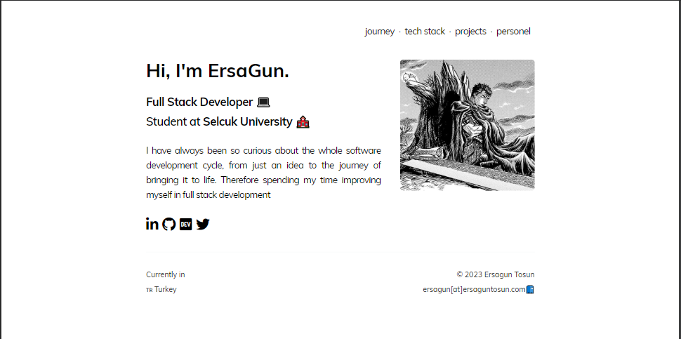

# Personel Website

Welcome to my personal website! This website serves as a hub to showcase my professional portfolio, skills, and achievements. Whether you're a potential employer, colleague, or just a visitor interested in what I do, feel free to explore and learn more about my work.

## Purpose

This website is created to provide an overview of my professional background, skills, and projects. It aims to:

- Showcase my portfolio and previous work experiences.
- Highlight my skills in various technologies and areas of expertise.
- Connect with potential employers, clients, and collaborators.
- Provide a platform for learning about my professional journey and interests.

## Technologies Used

This website is built using the following technologies:

- **HTML:** For the basic structure and content of the website.
- **TailwindCSS / CSS:** For styling and layout.
- **JavaScript / ReactJS:** For dynamic content and interactivity.
- **Vercel:** For hosting and deployment.

## Features

- **Portfolio:** View my projects, skills, and previous work experiences.
- **Interactive Elements:** Experience smooth interactions and dynamic content.
- **Responsive Design:** The website is optimized for various devices and screen sizes.

## Contributing

I appreciate contributions and feedback. If you find a bug, have a feature request, or want to contribute in any other way, please open an issue or submit a pull request.
